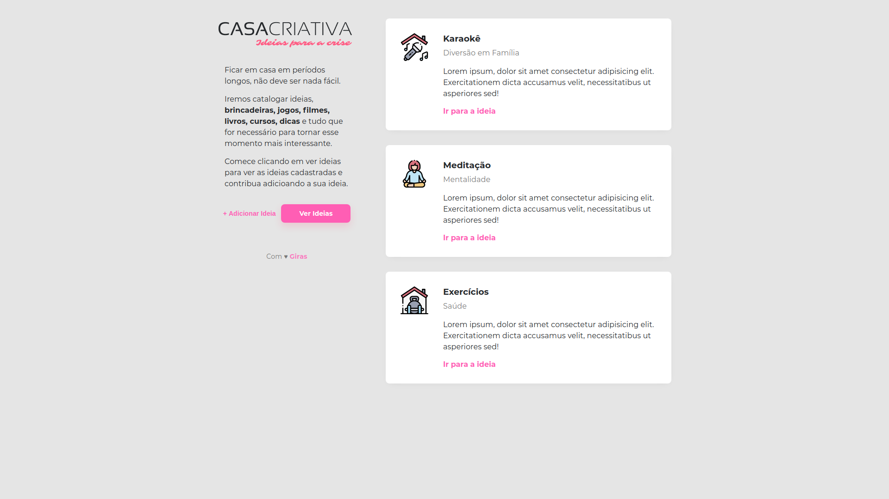
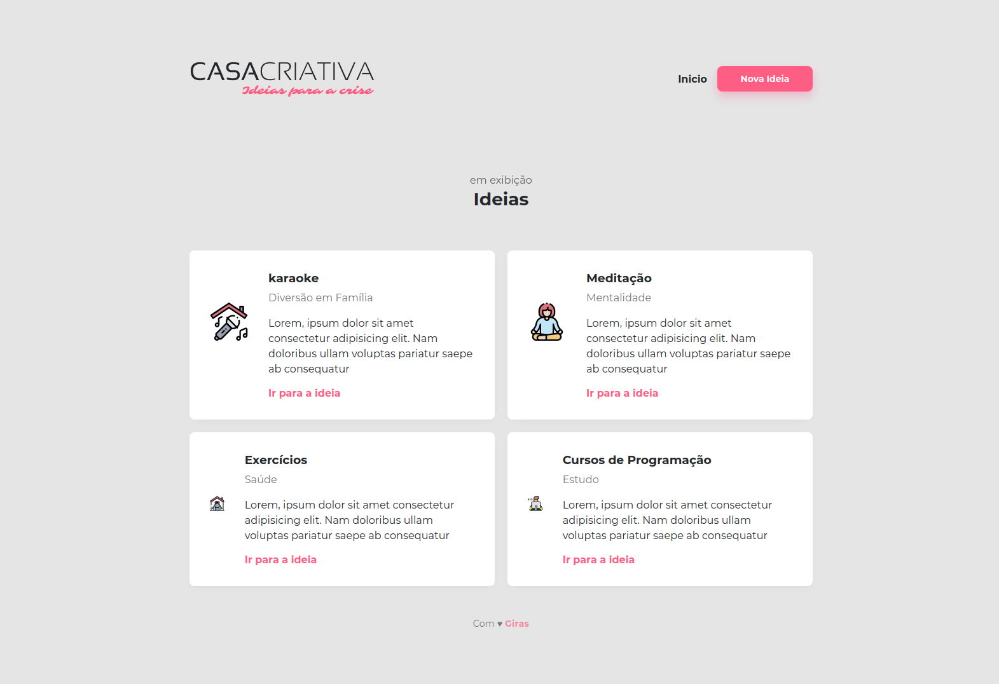
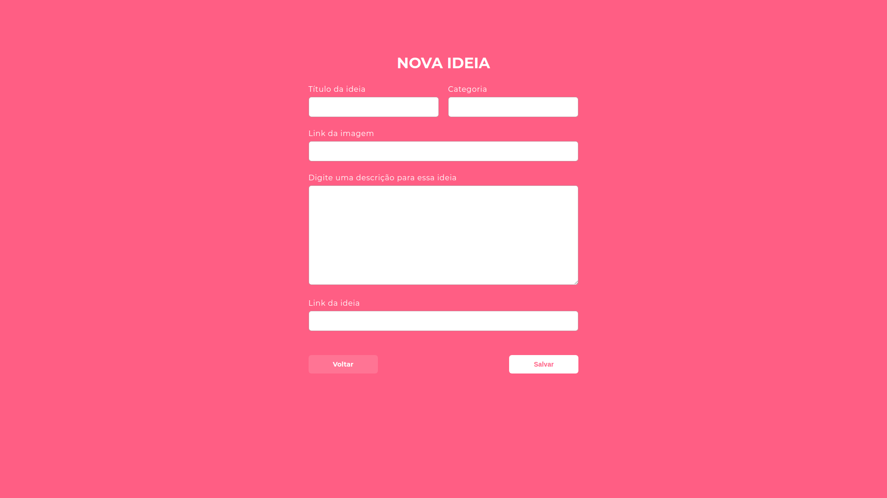

<h1 align="center">Casa Criativa</h1>
 

### Projeto criado durante o WorkshopDev, do curso da Rocketseat!
 

## Site desenvolvido com a proposta de cadastrar ideias do que fazer durante a quarentena ou quando estiver sem ideias do que fazer.

## Projeto desenvolvido com as seguintes tecnologias:

- [HTML](https://developer.mozilla.org/pt-BR/docs/Web/HTML)
- [CSS](https://developer.mozilla.org/pt-BR/docs/Web/CSS)
- [Javascript](https://developer.mozilla.org/pt-BR/docs/Web/JavaScript)
- [Node.js](https://nodejs.org/en/)

  

 

  

  

## Para copiar ou testar o projeto

1. Faça o clone ou download deste repositório
2. Instale as dependências com: `yarn`
4. Para iniciar o Node `yarn dev`
5. Entre no seu navegador com a url: `http://localhost:3000`

